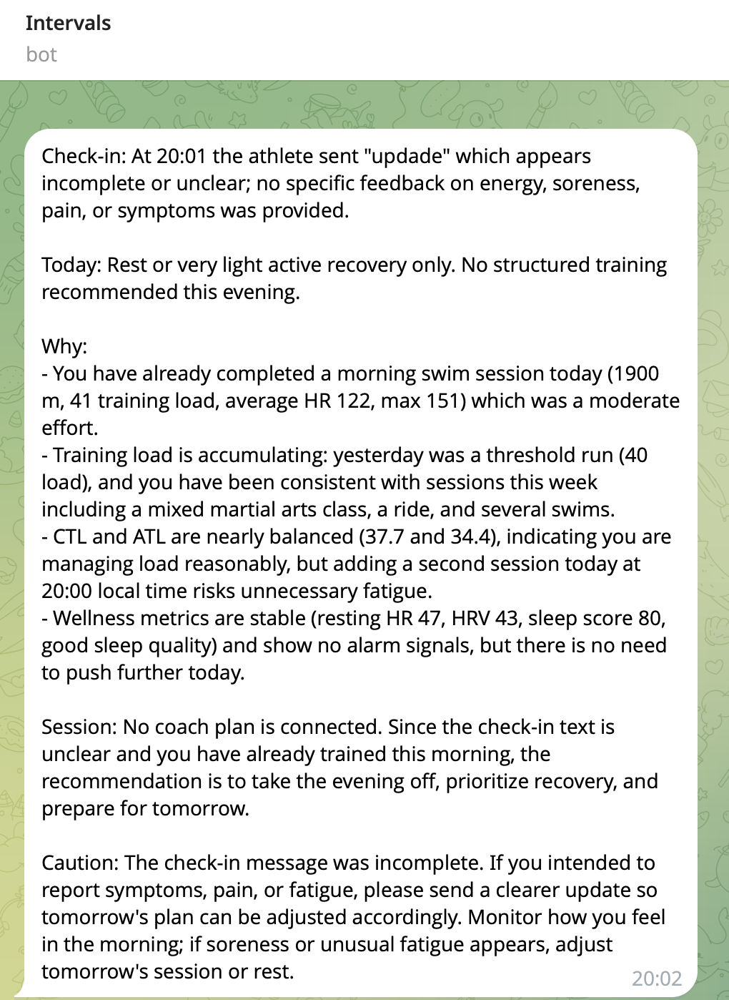

# Training Advisor (Тренировочный Ассистент)

[English](README.md) | **Русский**

Ежедневный отчет о готовности к тренировкам и планирование нагрузки, доставляемый в Telegram с использованием Intervals.icu, Claude от Anthropic и GitHub Actions.

## Что делает бот
- Получает данные о последних активностях и здоровье из Intervals.icu
- Анализирует тренировочную нагрузку, сессии и показатели восстановления
- Создает краткий тренерский отчет с помощью Claude (Anthropic), используя ваши настройки профиля
- Отправляет отчет в Telegram
- Работает автоматически по расписанию И мгновенно при отправке сообщения боту
- Опционально интегрируется с планом вашего тренера в TrainingPeaks

**Это инструмент для поддержки принятия решений, а не медицинская консультация.** Он не должен заменять указания вашего тренера, симптомы или рекомендации врача.

## Пример отчета

Вот как выглядит типичный отчет в Telegram:



Бот анализирует ваше сообщение о самочувствии, тренировочные данные и метрики здоровья, чтобы дать персонализированные рекомендации по отдыху или тренировкам.

---

## Полное руководство по настройке

### Необходимые аккаунты

Вам понадобятся аккаунты:
- **Intervals.icu** (бесплатный или платный) - для тренировочных данных
- **Anthropic Console** (https://console.anthropic.com) - для API Claude (требует кредитов/оплаты)
- **Telegram** - для получения отчетов
- **GitHub** - для хостинга и запуска автоматизации
- **Cloudflare** (бесплатный) - опционально, для мгновенной активации через webhook

---

## Часть 1: Основная настройка (обязательно)

### Шаг 1: Сделайте форк репозитория

1. Нажмите **Fork** в правом верхнем углу этого репозитория
2. Это создаст вашу собственную копию, куда вы добавите свои секреты

### Шаг 2: Получите учетные данные Intervals.icu

1. Перейдите на https://intervals.icu
2. Войдите в свой аккаунт
3. Перейдите в **Settings → API**
4. Нажмите **Generate API Key** (скопируйте ключ)
5. Запомните ваш **Athlete ID** (виден в URL или разделе API)

### Шаг 3: Получите API ключ Anthropic

1. Перейдите на https://console.anthropic.com (или platform.claude.com)
2. **Добавьте оплату/кредиты** (Settings → Billing) - API требует оплаты
   - Добавьте способ оплаты ИЛИ купите предоплаченные кредиты (минимум $5)
   - API отдельно от подписки Claude Pro
3. Перейдите в **Settings → API Keys**
4. Нажмите **Create Key**
5. Скопируйте ключ (начинается с `sk-ant-api...`)

### Шаг 4: Создайте Telegram бота

1. Откройте Telegram и найдите **@BotFather**
2. Отправьте `/newbot` и следуйте инструкциям
3. BotFather даст вам **токен бота** - скопируйте его
4. Начните чат с вашим новым ботом (отправьте `/start`)
5. Получите ваш **Chat ID**:
   - Отправьте сообщение боту
   - Откройте: `https://api.telegram.org/bot<ВАШ_ТОКЕН_БОТА>/getUpdates`
   - Найдите `"chat":{"id":123456789}` - это число и есть ваш Chat ID

### Шаг 5: Добавьте секреты в GitHub Actions

В вашем форкнутом репозитории:

1. Перейдите в **Settings → Secrets and variables → Actions**
2. Нажмите **New repository secret** для каждого из этих:

| Название секрета | Значение | Где получить |
|-----------------|----------|--------------|
| `INTERVALS_API_KEY` | Ваш API ключ Intervals.icu | Intervals.icu → Settings → API |
| `INTERVALS_ATHLETE_ID` | Ваш ID спортсмена | Профиль/раздел API в Intervals.icu |
| `ANTHROPIC_API_KEY` | Ваш API ключ Anthropic | console.anthropic.com → API Keys |
| `TELEGRAM_BOT_TOKEN` | Токен вашего бота | @BotFather в Telegram |
| `TELEGRAM_CHAT_ID` | Ваш числовой chat ID | Из вызова API getUpdates |
| `TRAININGPEAKS_ICAL_URL` | (Опционально) URL синхронизации календаря | TrainingPeaks → Settings → Calendar sync |

**Важно:** Эти секреты зашифрованы и никогда не показываются в логах или коде.

### Шаг 6: Настройте ваш профиль

1. Отредактируйте `config/profile.json` в вашем репозитории
2. Обновите вашими реальными тренировочными зонами, целями и лимитами:
   - `timezone`: Ваш часовой пояс (например, "Asia/Tashkent", "Europe/Moscow")
   - `vt1_hr_bpm`, `vt2_hr_bpm`: Ваши зоны пульса
   - `ftp_watts`: Ваш функциональный порог мощности (если велосипед)
   - `weekly_training_hours_target`: Целевой недельный объем
   - `goal`: Ваша текущая тренировочная цель

### Шаг 7: Протестируйте!

1. Перейдите на вкладку **Actions** в вашем репозитории
2. Нажмите **Daily Training Advisor**
3. Нажмите **Run workflow → Run workflow**
4. Подождите 30-60 секунд
5. Проверьте Telegram - вы должны получить ваш первый отчет!

**Если не работает:** Проверьте лог Actions на ошибки (обычно проблемы с API ключами или отсутствие данных в Intervals.icu)

---

## Часть 2: Мгновенная активация через Webhook (опционально, но рекомендуется)

По умолчанию отчеты запускаются по расписанию (06:37 и 16:27 UTC). Добавьте webhook для мгновенных отчетов при отправке сообщения боту!

### Шаг 1: Установите Node.js и wrangler

На вашем компьютере:
```bash
# macOS
brew install node
npm install -g wrangler

# Или скачайте с https://nodejs.org
```

### Шаг 2: Разверните Cloudflare Worker

```bash
cd telegram-trigger
wrangler login
wrangler deploy
```

Скопируйте URL worker'а, который будет показан (например, `https://training-advisor-telegram-trigger.ВАШ-ПОДДОМЕН.workers.dev`)

### Шаг 3: Создайте Personal Access Token в GitHub

1. Перейдите в GitHub → Settings → Developer settings → Personal access tokens → Fine-grained tokens
2. Нажмите **Generate new token**
3. Настройте:
   - Название токена: "Training Advisor Telegram Trigger"
   - Доступ к репозиторию: **Only select repositories** → выберите ваш форк training-advisor
   - Разрешения: **Actions** → Read and write
4. Сгенерируйте и скопируйте токен

### Шаг 4: Установите секреты worker'а

```bash
cd telegram-trigger

# Установите GitHub PAT
wrangler secret put GITHUB_PAT
# Вставьте ваш GitHub токен при запросе

# Установите Telegram Chat ID
wrangler secret put TELEGRAM_CHAT_ID
# Вставьте ваш числовой Telegram chat ID

# Сгенерируйте и установите секрет webhook
openssl rand -hex 24
# Скопируйте вывод, затем:
wrangler secret put TELEGRAM_WEBHOOK_SECRET
# Вставьте случайную строку
```

**Сохраните эту случайную строку - она понадобится на следующем шаге!**

### Шаг 5: Зарегистрируйте webhook в Telegram

Замените плейсхолдеры и выполните:

```bash
curl "https://api.telegram.org/bot<ВАШ_ТОКЕН_TELEGRAM_БОТА>/setWebhook" \
  -d "url=https://training-advisor-telegram-trigger.ВАШ-ПОДДОМЕН.workers.dev" \
  -d "secret_token=<СЛУЧАЙНАЯ_СТРОКА_ИЗ_ШАГА_4>"
```

Вы должны увидеть: `{"ok":true,"result":true,...}`

### Шаг 6: Протестируйте мгновенную активацию

Отправьте любое сообщение вашему боту → вы должны получить отчет в течение 5-10 секунд!

---

## Как использовать

### Ежедневные чек-ины

Отправьте боту сообщение о вашем самочувствии:

```
энергия 7, ноги чувствуют себя хорошо, выспался
```

Или включите запланированную тренировку от тренера:

```
энергия 6, немного устал. План: 4x8 мин порог бег
```

Отчет будет:
- Резюмировать ваш чек-ин
- Учитывать ваши данные из Intervals.icu
- Следовать плану тренера (если указан)
- Рекомендовать сегодняшнюю тренировку или отдых

### Специальные сообщения

- Отправьте `skip`, если хотите запланированный отчет без чек-ина
- Команды бота вроде `/start` игнорируются

### Запланированные отчеты

Даже без отправки сообщений, отчеты автоматически запускаются в:
- **06:37 UTC** (утренний отчет)
- **16:27 UTC** (вечерний отчет)

*Измените это время в `.github/workflows/daily.yml` при необходимости*

---

## Настройка

### Изменить расписание

Отредактируйте `.github/workflows/daily.yml`, строки 17-18:

```yaml
- cron: "37 1 * * *"   # Формат: "минута час * * *" в UTC
- cron: "27 11 * * *"
```

Используйте https://crontab.guru для помощи с синтаксисом cron.

### Изменить модель AI

Модель по умолчанию - `claude-sonnet-4-5-20250929` (Claude Sonnet 5).

Чтобы использовать другую модель:
1. Перейдите в **Settings → Secrets and variables → Actions → Variables**
2. Добавьте новую переменную с именем `ANTHROPIC_MODEL`
3. Установите значение на предпочитаемый ID модели (например, `claude-3-5-sonnet-20240620`)

### Настроить тренировочные рекомендации

Отредактируйте `config/profile.json` для уточнения:
- Зоны пульса
- Зоны мощности
- Целевой недельный объем
- Тренировочные цели

AI использует эти параметры для адаптации рекомендаций к вашему уровню подготовки.

---

## Данные и конфиденциальность

- **Секреты** хранятся зашифрованными в GitHub Actions (никогда в коде)
- **Тренировочные данные** из Intervals.icu отправляются в API Anthropic для генерации отчетов
- **Данные не сохраняются** после генерации отчета
- Ознакомьтесь с политикой конфиденциальности Anthropic на https://www.anthropic.com/privacy

**Рекомендация:** Проверьте настройки обмена данными в Intervals.icu и Anthropic перед включением.

---

## Решение проблем

### "Error: Missing required environment variable"
- Проверьте, что все секреты установлены в GitHub Actions secrets
- Имена секретов должны совпадать точно (с учетом регистра)

### "credential validation failed" или "404 model not found"
- Проверьте ваш API ключ Anthropic на console.anthropic.com
- Убедитесь, что у вас настроены кредиты/оплата
- Проверьте, что ваш аккаунт имеет доступ к используемой модели

### "409 Conflict" от Telegram
- Вы не можете использовать одновременно `getUpdates` и webhooks
- Если вы настроили webhooks, запланированный cron будет работать, но ручные вызовы API нет
- Это ожидаемое поведение

### Workflow запускается, но сообщение не получено
- Проверьте, что Telegram бот был запущен (отправьте `/start` боту)
- Проверьте, что `TELEGRAM_CHAT_ID` правильный (числовой ID, не username)
- Проверьте логи Actions на ошибки Telegram API

### Нет данных из Intervals.icu
- Проверьте ваши `INTERVALS_API_KEY` и `INTERVALS_ATHLETE_ID`
- Убедитесь, что в вашем аккаунте Intervals.icu есть последние активности
- Проверьте, что доступ к API включен в настройках Intervals.icu

### Webhook не срабатывает
- Запустите `wrangler tail` во время отправки сообщения, чтобы увидеть логи worker'а
- Проверьте статус webhook: `curl "https://api.telegram.org/bot<ТОКЕН>/getWebhookInfo"`
- Проверьте, что все секреты worker'а установлены правильно

---

## Оценка стоимости

- **GitHub Actions**: Бесплатно (в пределах лимитов - ~2,000 минут/месяц)
- **Cloudflare Workers**: Бесплатный тариф (100,000 запросов/день)
- **Intervals.icu**: Бесплатно или $8/месяц за премиум
- **Anthropic API**: Оплата по факту (~$0.01-0.05 за отчет, в зависимости от модели)
- **Telegram**: Бесплатно

**Примерная месячная стоимость:** $1-5 за вызовы API, в зависимости от модели и использования.

---

## Авторы

Создано с использованием:
- [Intervals.icu](https://intervals.icu) - Аналитика тренировок
- [Anthropic Claude](https://www.anthropic.com) - AI тренерские инсайты
- [Telegram Bot API](https://core.telegram.org/bots) - Доставка сообщений
- [GitHub Actions](https://github.com/features/actions) - Автоматизация
- [Cloudflare Workers](https://workers.cloudflare.com) - Обработка webhook

---

## Лицензия

Лицензия MIT - свободно форкайте, модифицируйте и делитесь!

---

## Вклад в проект

Нашли баг или есть идея функции? Откройте issue или pull request!

**Перед тем как делиться вашим форком:** Убедитесь, что никакие секреты не закоммичены в вашу git историю. Все учетные данные должны быть только в GitHub Actions secrets.
